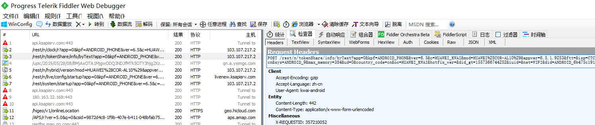
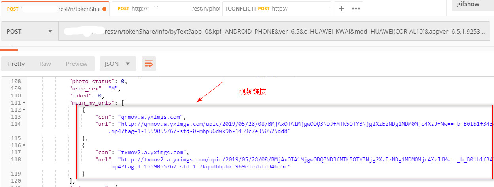

# 学习

反编译的快手Apk版本: 6.5.0.9223


最终通过 Fiddler5 检测 apk 版本 为`6.5.1.9253`(手机安装的版本)，对 粘贴板中的分享链接，有一个请求是



通过这个请求，直接有Api 可以进行处理解析

通过 Postman工具请求这个Api，返回结果直接返回了，害自己研究那么久反编译的Apk文件.....




-----

以下纯属个人笔记

1. `com.kuaishou.gifshow.e.a` 找到   

```
public static String c() {
   return a.getString("ShareUrlCopy", "http://www.gifshow.com/fw/photo");
}
```

通过 [Android简易数据存储之SharedPreferences](https://www.cnblogs.com/rwxwsblog/p/4802708.html) 了解到，这是一个简易的存储器，应该是保存App中的一些操作的链接列表

`com.yxcorp.gifshow.util.config.ConfigHelper` 中唯一使用了这个方法

```
private static f c = ......

```

`com.yxcorp.retrofit.consumer.f` 涉及到 `io.reactivex.subjects.PublishSubject` 这个包的`subscribe`,需要了解一下


